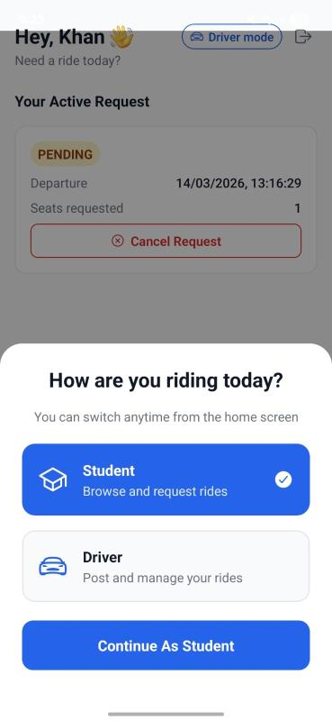
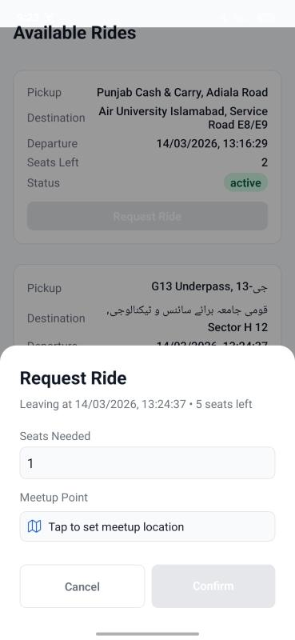
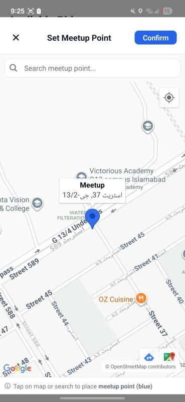
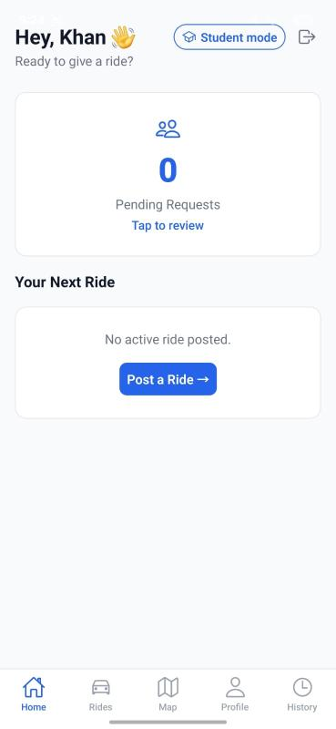
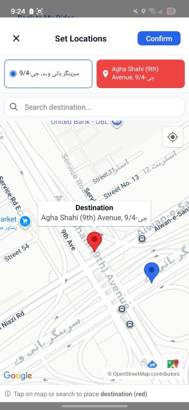
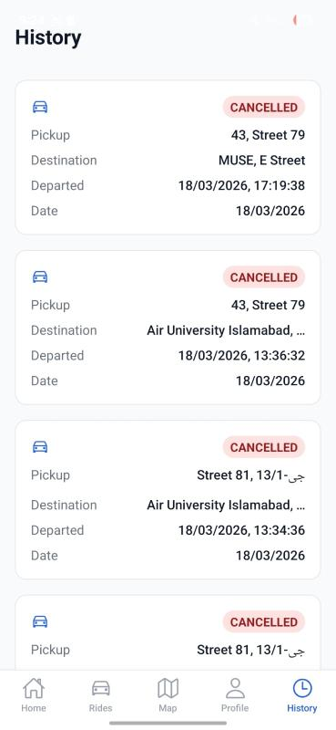

# Campus Carpool

Campus Carpool is a real-time mobile ride-sharing application built with React Native for university students.

The platform enables students traveling to the same university or nearby campuses to share rides safely and affordably by connecting student drivers with available seats to students looking for transportation.

The application focuses on reducing daily commuting costs, improving convenience, and minimizing traffic congestion through a campus-focused ride-sharing ecosystem.

---

# Problem

Daily transportation through ride-hailing services can become expensive for students over time.

At the same time, many university students already commute to campus with empty seats available in their vehicles.

Campus Carpool bridges this gap by providing a dedicated student-focused carpooling platform where:

- Drivers can offer available seats
- Students can request rides nearby
- Both parties can coordinate meetup locations through maps

---

# Solution

Campus Carpool provides a unified ride-sharing system with dynamic dual-role functionality.

Instead of requiring separate driver and passenger accounts, users authenticate once and can dynamically switch between:

- Student Mode
- Driver Mode

The application uses a capability-based role system where driver functionality becomes available only if the user has a registered driver profile.

This creates a seamless and scalable user experience while avoiding duplicated authentication systems.

---

# Features

- Dynamic Student and Driver role switching
- Single authentication system for all users
- Request rides as a passenger
- Create and manage rides as a driver
- Meetup location selection using maps
- Driver dashboard for ride management
- Ride history tracking
- Real-time ride synchronization
- Persistent user session handling
- Mobile-first responsive UI
- Modular and scalable project architecture

---

# Technical Highlights

- Implemented dynamic dual-role architecture without separate authentication systems
- Built real-time ride synchronization using Supabase Realtime WebSocket subscriptions
- Designed Context API based global state management for authentication and role handling
- Implemented persistent mode switching using AsyncStorage
- Secured database operations using Supabase Row Level Security (RLS) policies
- Integrated map-based meetup location workflows
- Structured project using scalable modular React Native architecture
- Built reusable components and centralized service layers
- Implemented live synchronization for ride updates and ride requests

---

# Application Screens

## Home Screen — Role Selection



Users can dynamically switch between Student and Driver modes from a unified account system.

---

## Request Ride — Student Mode



Students can create ride requests by selecting pickup and destination locations.

---

## Meetup Location Selection



Interactive map interface allowing users to search or tap to select meetup locations.

---

## Driver Dashboard



Drivers can manage active rides, monitor ride requests, and track ride activity through a dedicated dashboard.

---

## Create Ride — Driver Mode



Drivers can publish rides with available seats for nearby students.

---

## Ride History



Drivers can track previous rides and monitor ride activity history.

---

# Tech Stack

## Frontend

- React Native
- Expo
- Expo Router
- TypeScript
- Context API
- AsyncStorage

## Backend & Infrastructure

- Supabase Authentication
- PostgreSQL Database
- Supabase Realtime
- Row Level Security (RLS)

## Maps & Location

- React Native Maps
- Location-based meetup selection

---

# Backend & Realtime Architecture

Campus Carpool uses Supabase as a backend-as-a-service platform for authentication, database management, and real-time synchronization.

Implemented backend systems include:

- Authentication and session management
- PostgreSQL relational database design
- Real-time WebSocket subscriptions using Supabase Realtime
- Row Level Security (RLS) based database protection
- Driver/student  management
- Persistent session synchronization
- Real-time ride activity updates

# Realtime Synchronization

Campus Carpool uses Supabase Realtime subscriptions to synchronize ride activity instantly across connected clients.

Realtime events currently include:

- Ride creation
- Ride updates
- Ride request synchronization
- Driver activity updates

This enables a live ride-sharing experience without requiring manual refreshes.

---

# Security

The application uses Supabase Row Level Security (RLS) policies to secure database operations.

Security rules ensure:

- Users can only modify their own rides
- Drivers manage only their own ride activity
- Protected database access through authenticated sessions
- Secure role-based data access

---

# System Architecture

```text
React Native Mobile App
        │
        ▼
Supabase Backend Services
├── Authentication
├── PostgreSQL Database
├── Realtime WebSocket Channels
└── Row Level Security Policies
```

---

# Project Structure

```bash
CampusCarpool/
├── app/
├── components/
├── context/
├── services/
├── hooks/
├── utils/
├── assets/
└── types/
```

---

## Completed Features

- Authentication flow
- Dynamic Student/Driver role system
- Ride request workflow
- Driver dashboard
- Ride posting workflow
- Meetup location selection
- Ride history tracking
- Real-time synchronization
- Persistent session handling

## Planned Improvements

- Push notifications
- Production deployment
- Improved location search and geocoding performance using OpenStreetMap APIs

# Project Status
  Production deployment has been intentionally postponed due to security considerations, and the need for proper operational approvals for a real-world campus ride-sharing environment.

---
